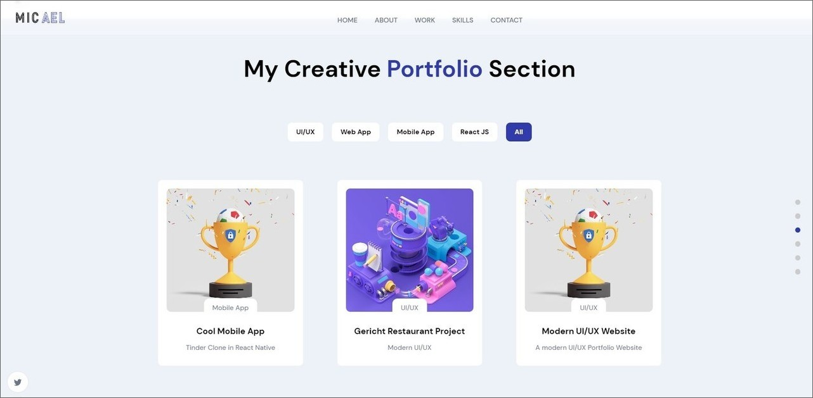
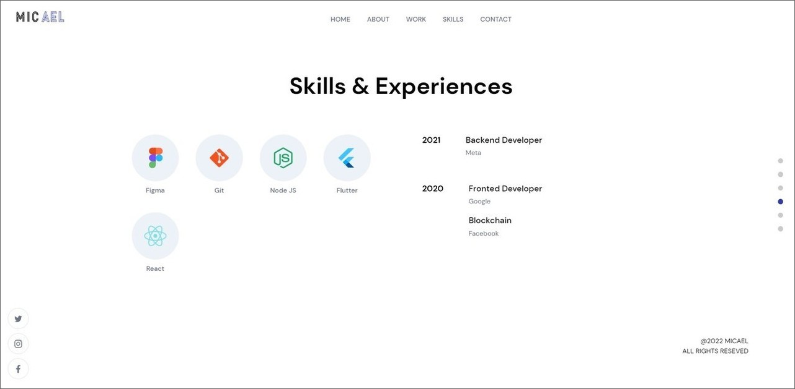
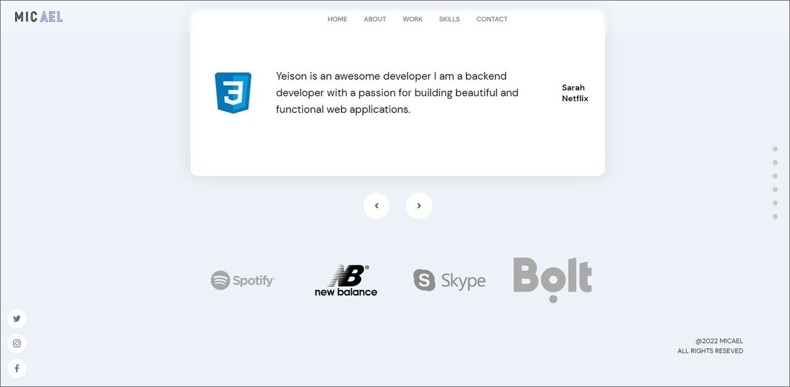
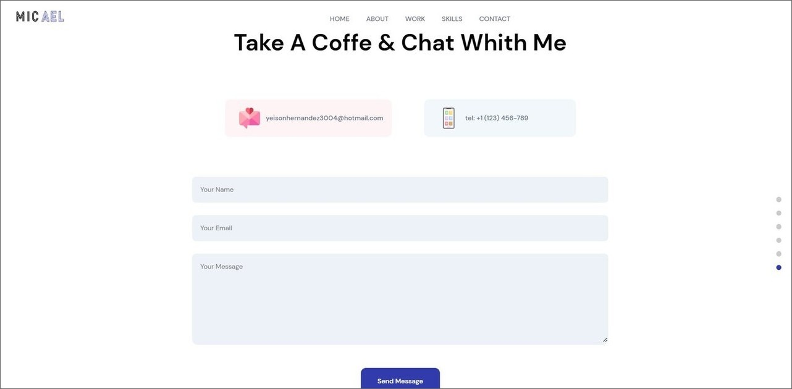
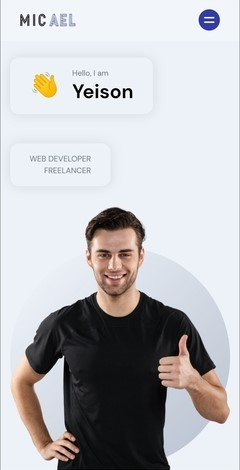
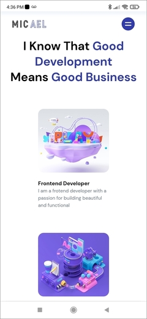
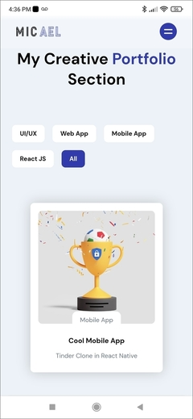
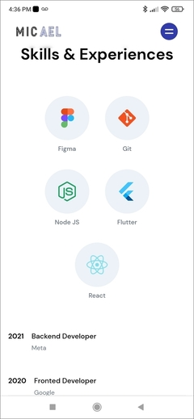
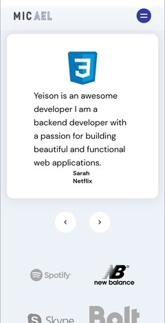
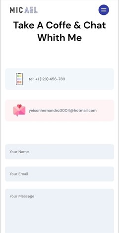

# 02-Portafolio Web
Este proyecto es una página web creada con React y TypeScript que muestra un portafolio de habilidades como Desarrollador front-end, back-end, diseñador web y desarrollador móvil. Además, es responsiva y utiliza Sanity.io para su gestión de contenido. También cuenta con secciones para proyectos, testimonios y contacto. Los estilos fueron desarrollados con Framer Motion y Sass.

## Tecnologías principales
-  React  
-  TypeScript  
-  Vite  
-  Sanity.io  
-  Framer Motion  
-  Sass  

## Capturas de pantalla
Las capturas de pantalla muestran una vista previa de la página en desktop.

## Créditos
Este proyecto fue creado a partir de un video tutorial de YouTube de "JavaScript Mastery". El enlace del curso es https://www.youtube.com/watch?v=3HNyXCPDQ7Q.

## Link
Puedes ver la página web en vivo en el siguiente enlace: [URL del sitio](https://yeison-porftfolio.netlify.app/).

## Comparación de tecnologías y características
El proyecto original del video tutorial utiliza JavaScript, mientras que este proyecto utiliza TypeScript.
